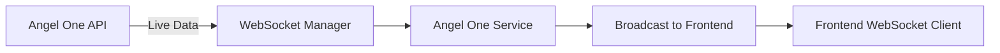

# Angel One API Integration - Problem Analysis & Solution

## Executive Summary

✅ **Good News:** Your Angel One API credentials are correctly configured and authentication is working perfectly!

❌ **The Problem:** The service is NOT automatically started. The Angel One WebSocket service needs to be manually triggered.

## Root Cause Identification

### ✅ What's Working:
1. **Environment Variables**: All Angel One credentials are properly configured in `.env`
2. **Dependencies**: All required packages (smartapi-python, pyotp, websocket-client) are installed
3. **Authentication**: Login to Angel One API is successful
4. **Backend Code**: The service architecture is properly implemented

### ❌ What's NOT Working:
1. **Service Not Started**: The Angel One WebSocket connection is not being initiated
2. **No Frontend Integration**: There's no frontend code to start the service or receive data
3. **Manual Trigger Required**: The service needs API calls to `/api/angel-one/start` to begin working

## Why You're Not Getting Data

The Angel One integration follows a **manual activation model**:

```
Frontend → Call /api/angel-one/start → Backend starts WebSocket → Data flows
```

**Currently Missing:** The frontend is NOT calling the start endpoint, so the WebSocket never connects.

## How to Fix It

### Option 1: Test Manually with API Calls (Quick Test)

Using Postman, cURL, or any API client:

1. **Start the backend server:**
   ```bash
   cd backend
   uvicorn main:app --reload
   ```

2. **Call the start endpoint:**
   ```bash
   POST http://localhost:8000/api/angel-one/start
   Headers: Authorization: Bearer YOUR_JWT_TOKEN
   Body:
   {
     "tokens": [
       {
         "exchangeType": 1,
         "tokens": ["26000", "26009"]
       }
     ],
     "mode": 1
   }
   ```

   Token examples:
   - `26000` = NIFTY 50
   - `26009` = BANK NIFTY
   - `1594` = RELIANCE (NSE)

3. **Check status:**
   ```bash
   GET http://localhost:8000/api/angel-one/status
   Headers: Authorization: Bearer YOUR_JWT_TOKEN
   ```

### Option 2: Auto-Start on Server Startup (Recommended)

Add auto-start logic to `main.py`:

```python
# In backend/main.py, modify the startup event:

@app.on_event("startup")
async def startup_event():
    """Initialize services on startup"""
    from app.services.angel_one_service import angel_one_service
    
    setup_angel_one_broadcast()
    print("Angel One broadcast callback registered")
    
    # Auto-start with default tokens (NIFTY & BANKNIFTY)
    default_tokens = [
        {"exchangeType": 1, "tokens": ["26000", "26009"]}  # NIFTY, BANKNIFTY
    ]
    
    try:
        angel_one_service.start(tokens=default_tokens)
        print("✓ Angel One service auto-started with default tokens")
    except Exception as e:
        print(f"⚠ Failed to auto-start Angel One service: {e}")
```

### Option 3: Frontend Integration (Complete Solution)

Need to add frontend code to control the service. Here's what's needed:

1. **Create an Angel One control component**
2. **Add WebSocket client to receive live data**
3. **Add UI controls for subscribing/unsubscribing to symbols**

## Testing the Fix

After implementing Option 2 (auto-start), run this test:

```bash
# Start the server
cd backend
uvicorn main:app --reload

# In another terminal, check the status
curl -X GET http://localhost:8000/api/angel-one/status \
  -H "Authorization: Bearer YOUR_JWT_TOKEN"
```

Expected response if working:
```json
{
  "is_running": true,
  "is_connected": true,
  "subscribed_tokens": [
    {"exchangeType": 1, "tokens": ["26000", "26009"]}
  ],
  "last_update": "2025-12-25T23:30:00"
}
```

## Important Notes

### Market Hours
⚠️ The stock market has specific hours:
- **NSE/BSE**: Monday-Friday, 9:15 AM - 3:30 PM IST
- **No Data During**: Weekends, holidays, after market hours

If testing outside market hours, you won't receive live tick data even if the connection is working.

### WebSocket Architecture



The data flow requires:
1. Authentication (✅ Working)
2. WebSocket connection (❌ Not started)
3. Token subscription (❌ Not configured)
4. Frontend listener (❌ Not implemented)

## Next Steps

**Immediate Actions:**
1. ✅ Implement auto-start in `main.py` (Option 2)
2. ✅ Test the service during market hours
3. ⏳ Add frontend integration for live data display
4. ⏳ Add UI controls for managing subscriptions

**Would you like me to:**
1. Implement the auto-start functionality in main.py?
2. Create a frontend component to control Angel One service?
3. Add a dashboard to display live market datafrom Angel One?

## Diagnostic Script Output

The test script confirmed:
- ✅ All dependencies installed
- ✅ All environment variables set
- ✅ Authentication successful
- ✅ API connection working

**Conclusion**: Your setup is correct. You just need to _start_ the service!
